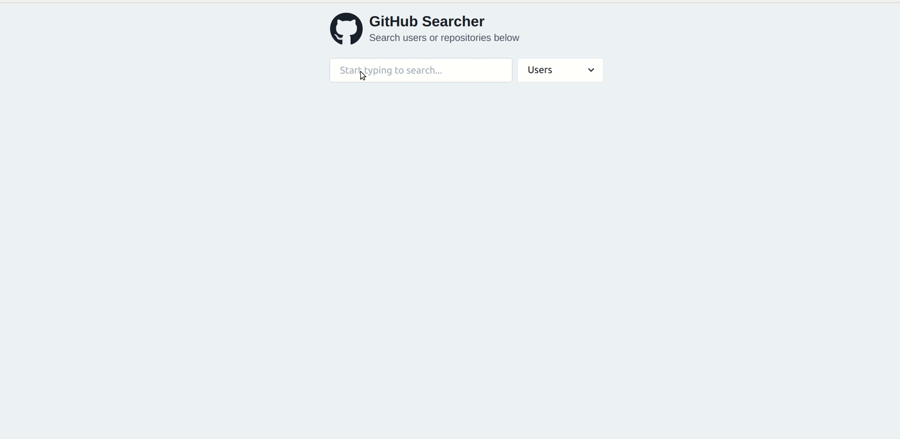
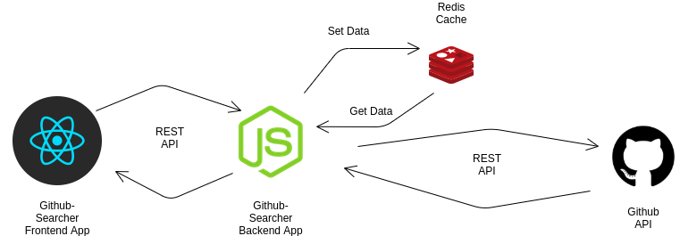
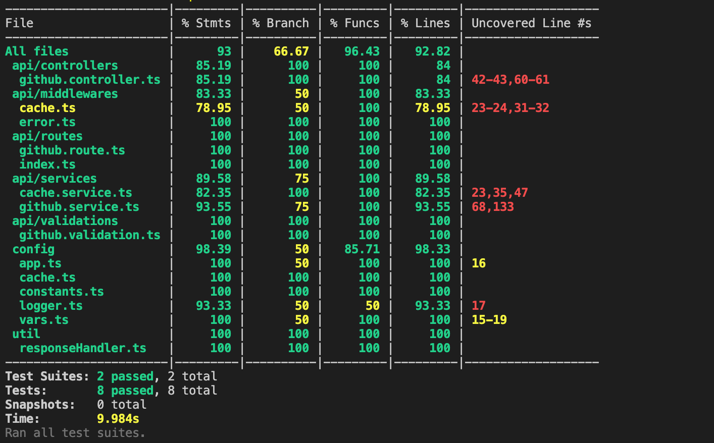

# GitHub Searcher App
>  Full-Stack Github searcher app built using Node.js, React & TypeScript
> 

## Contents

  - [Problem Statement](#problem-statement)
  - [Architecture](#architecture)
    - [Flow Diagram](#flow-diagram)
    - [Frontend](#frontend)
    - [Backend](#backend)
- [Built With](#built-with) 
- [Getting stared](#getting-started)
- [Build](#build)
- [Test](#test)
- [Run](#run)
- [Docs](#docs)
- [Test Coverage](#test-coverage)
- [What's not included](#whats-not-included)
## <a id="problem-statement" style="color: black;">Problem Statement</a>
You are required to build a full stack application which consists of :- 

> A simple single page application That allows the users to search the users or repositories on GitHub. The results will be fetched from the Backend REST API.

> Write an "Search" Backend API endpoint which eventually collect the data from Github & stores it in REDIS.
Create two API Endpoints:
"/api/search" :
Receives a POST request with search type(users or repositories or issues) & search text(mandatory).
The results will be fetched from the GitHub API & cache it for atleast 2 hours.
"/api/clear-cache" : Clear Backend Caching

## <a id="architecture" style="color: black;">Architecture</a>


### <a id="diagram" style="color: black;">Flow Diagram</a>

### <a id="frontend" style="color: black;">Frontend</a>
This is the directory structure for ```frontend```, it is created by ```create-react-app``` with ```--template typescript``` flag, which helps us to create react project.
```
client
├── build                    # All the generated files will go here, and will run from this folder
├── src                      # The source code of the application
│   ├── components           # All the components of the application
|   ├── config               # All the configuration files
|   ├── store                # Store & Reducers
|   ├── types                # Types
|   ├── app.tsx              # App component
│   ├── index.tsx            # Entry point of the app
├── package.json             # The list of 3rd party libraries and utilities   
└── tsconfig.json            # Typescript related configuration
```

### <a id="backend" style="color: black;">Backend</a>
```backend``` directory structure is as follows, and the necessary information is contained in each folder.

```
server
├──__tests__                 # All the test suites
├── build                    # All the generated files will go here, and will run from this folder
├── src                      # The source code of the application
│   ├── api                  # All the api related directories e.g. controllers, routes, services,middleware
|   ├── config               # All the configuration files e.g. app.ts, cache.ts, logger.ts
|   ├── util                 # Utility files
|   ├── server.ts            # Entry point of the app
│   ├── index.tsx            # Entry point of the app
├── package.json             # The list of 3rd party libraries and utilities  
├── .env.example             # Env example file for enviroment variables 
├── jest.config.js           # Jest configuration for testing    
└── tsconfig.json            # Typescript related configuration.
```

## <a id="built-with" style="color: black;">Built With</a>
- **React.js** - for building frontend app
- **TypeScript** -  for static typing
- **Node.js** - for building backend server
- **Expressjs** - for building backend app
- **Redis** - for caching github search data
- **Jest with supertest** - for writing Test cases
- **Chakra-UI** - for building UI Components 
- **Redux and redux-persist** - for state management
- **Redux Toolkit** - toolset for efficient Redux development
- **Axios** - for rest api communications between client - server and server - github api's
- **Swagger** -  for writing api documentations
- **Winston** -  for logging (used file transport)
  
## <a id="getting-started" style="color: black;">Getting Started</a>
Before getting started, you need .env file at server/ following the .env.example file located in server directory.

```bash
# copy env.example to env (you can change the default port which is 3001)
$ cp .env.example env

change REDIS_URL to your redis instance connection URL (Redis should be installed and running)
```

## <a id="build" style="color: black;">Build</a>

```bash
bash ./build.sh 
```

## <a id="test" style="color: black;">Test</a>
```bash
yarn test
```

## <a id="run" style="color: black;">Run</a>
```bash
bash ./run-server.sh  # for running server
bash ./run-client.sh  # for running client
```

## <a id="docs" style="color: black;">Docs</a>
```bash
http://localhost:3001/api/docs  #swagger api documentation
```
## <a id="test-coverage" style="color: black;">Test Coverage</a>


## <a id="whats-not-included" style="color: black;">What's not included</a>

- Search UI transition from center to up
- Test cases for frontend app